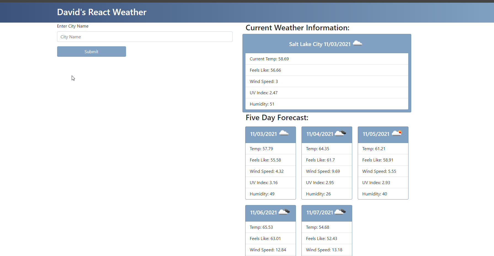

# David Shaw's Portfolio  

  ## About/Description

  David's weather dashboard allows a user to search by a city.  The city value is passed into the openweather geo finder api to find the latitude and longitude of the city.  It then passes those values into the openweather forecast api where it loads the city name, current temp, wind speed, humidity, and UV index with a color dot for the user to read.  It will display the next five days in cards below for the user as well.  It uses local storage to create buttons for the user to click and search for that information again. 

  View Page Here: https://ds-weather-dashboard.netlify.app/

  ## Table of Contents

  * [Installation](#installation)
  * [Usage](#usage)
  * [Languages](#languages)
  * [Contributing](#contributing)
  * [License](#license)
  * [Tests](#tests)
  * [Questions](#questions)
  
  ## Installation

  To run this locally npm start will kick off the React scripts and load it on a localhost. Otherwise, this is hosted on Netlify.

  ## Usage

  ### Screenshots of App

  #### Basic page after search

  

  ## Languages

  - React.js
  - Javascript
  - CSS
  - BootStrap
  - MomentJS
  - OpenWeather API

  ## Contributing

  Contributions by: David Shaw

  If you would like to contribute to this project we follow the [Contributor Covenant](https://www.contributor-covenant.org/)

  ## License

  https://choosealicense.com/licenses/mit/

  ## Tests

  Tests were written to help ensure each component renders correct as well as some tests to ensure contained information is correct.  The built in React npm run test will kick off these tests.

  ## Questions:

  If you have any questions please contact us or refer to our github below:

  Email Us At: david.shaw1242@gmail.com

  Github Repo: https://github.com/ds1242/weather-react